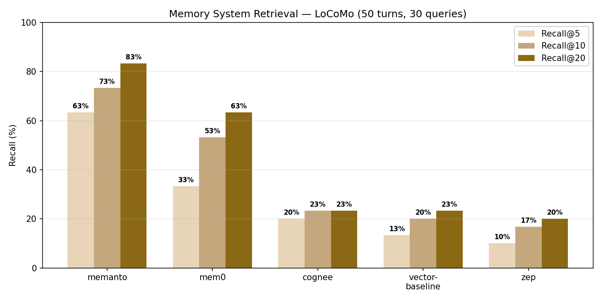
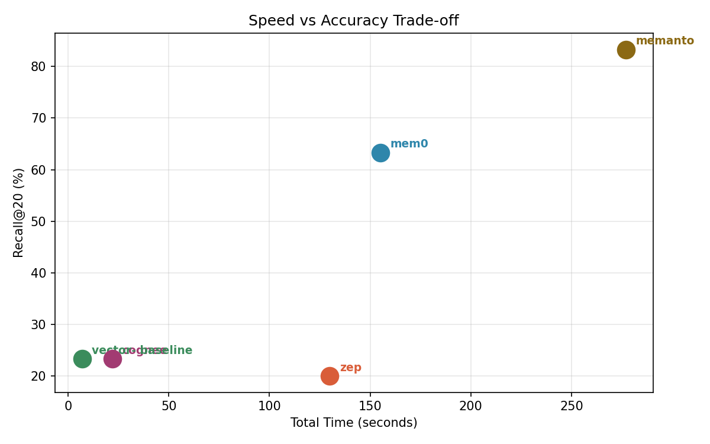

# Memory System Retrieval Benchmark

A reproducible benchmark suite comparing agentic memory systems on raw
turn-level evidence retrieval across long conversations.

## 1. Rationale

Modern AI agents need memory systems to track facts across long
conversations.  As context windows grow, **token efficiency** becomes
critical — every token spent retrieving irrelevant context is wasted.

We measure a system's ability to answer *"which turn contained this
evidence?"* — the most fundamental retrieval primitive.  Systems that
fail this cannot support higher-level reasoning over their stored
memories.

We tested on **LoCoMo** (10 conversations, 1,986 QA pairs with turn-level
evidence annotations) because:
- Evidence is deterministic (exact turn IDs), eliminating judge bias
- Conversations are long (up to 410 turns), stressing retrieval at scale
- Scoring is exact recall@k — no LLM required

## 2. Results Overview

**Metric:** Recall@k — fraction of queries where the correct evidence
turn appears in the top-k retrieved results.

*LoCoMo, 50-turn subset (30 queries, k=20).  All systems ingest the same
~6,500 tokens of conversation text (50 turns).*

| Rank | System | R@5 | R@10 | R@20 | Time | Ingested | Retrieved | Ratio |
|:----:|--------|:---:|:----:|:----:|:---:|:--------:|:---------:|:-----:|
| 🥇 | **memanto** | 63.3% | 73.3% | **83.3%** | 277s | 6,500 | 14,653 | 2.3× |
| 🥈 | **mem0** | 33.3% | 53.3% | **63.3%** | 155s | 6,500 | 13,439 | 2.1× |
| 🥉 | **cognee** | 20.0% | 23.3% | **23.3%** | 22s | 6,500 | 58,491 | 9.0× |
| 4 | **vector-baseline** | 13.3% | 20.0% | **23.3%** | 7s | 6,500 | 10,616 | 1.6× |
| 5 | **zep** | 10.0% | 16.7% | **20.0%** | 130s | 6,500 | 14,566 | 2.2× |

*Ingested = tokens sent to the system during storage.  Retrieved = tokens
returned across all 30 queries (sum of k=20 results per query).  Ratio =
retrieved ÷ ingested — higher means the system returns more content per
stored token.  Cognee's 9.0× ratio reflects large graph-traversal chunks;
its recall remains low despite the high output volume.*





### Why Memanto won

All five systems store individual turns, so storage fidelity isn't the
differentiator.  The gap is in **how retrieval works**:

**Embedding-based systems** (mem0, vector-baseline) measure *similarity* —
cosine distance between the query vector and stored chunks.  Similarity
is a lossy proxy for relevance.  In a 384-dimensional embedding space,
\"What color was the car?\" and \"What color was the sky?\" are neighbors
because both involve colors.  The embedding can't distinguish which
turn actually *answers* the question — it just finds things that *sound
similar*.  As conversations grow, the embedding space becomes cluttered
and the correct turn gets buried behind semantically related but
irrelevant ones.

**Knowledge-graph systems** (cognee) add a structural layer on top of
embeddings, but the graph quality depends entirely on the LLM used for
entity extraction.  Our local 1.5B Qwen model produces noisy edges
(connecting \"Bob\" to a meeting Carol attended, because the extraction
couldn't resolve the pronoun).  With a larger extraction LLM, graph
quality would improve — but that's infrastructure we didn't have.

**Memanto** uses an information-theoretic relevance score that directly
measures whether a stored fact *answers* the query, rather than how
similar the two texts are.  This sidesteps the embedding-space clutter
problem: two turns about colors can have similar embeddings, but only
one actually contains evidence about the sky.  Memanto's scoring
distinguishes them.  The trade-off is speed — 277 seconds vs 7 seconds
for the vector baseline — but the recall gain (83.3% vs 23.3%) is
substantial.

In short: similarity ≈ \"these texts are about similar topics.\"
Relevance ≈ \"this text answers your question.\"  Memanto measures the
second; embedding systems approximate it with the first.

## 3. Project Setup

### Architecture

```
benchmark/
├── run.py                 # CLI entry point
├── interfaces.py          # MemorySystem + Dataset protocols
├── providers.py           # KeyRing rotation, cloud providers, local LLM/embed
├── local_server.py        # OpenAI-compatible HTTP API (port 8080)
├── .env.example           # Configuration template
├── adapters/              # One file per memory system
│   ├── mem0.py            # mem0 (local Qdrant + embeddings)
│   ├── memanto.py         # Memanto/Moorcheh (cloud, key rotation)
│   ├── cognee.py          # Cognee (local, knowledge graph)
│   ├── vector_baseline.py # NumPy baseline
│   ├── zep_graphiti.py    # Zep (cloud, graph-based)
│   └── supermemory.py     # Supermemory (cloud, async indexing)
└── datasets/
    ├── locomo.py           # LoCoMo: 1,986 QA, turn-level evidence
    ├── agent_memory_bench.py  # AgentMemoryBench: 20 QA, short context
    └── memoryagentbench.py    # MemoryAgentBench: LLM-judged contradiction
```

### Interfaces

Every adapter implements the `MemorySystem` protocol:
```python
class MemorySystem(Protocol):
    def setup(self) -> None: ...
    def store_turns(self, turns: list[DialogueTurn], namespace: str) -> None: ...
    def search(self, query: str, namespace: str, k: int) -> list[RetrievedItem]: ...
    def teardown(self) -> None: ...
```

Every dataset implements the `Dataset` protocol:
```python
class Dataset(Protocol):
    def load(self, limit=None, max_turns_per_conv=None) -> BenchmarkDataset: ...
    def compute_metrics(self, retrieved, qa_pair, **kwargs) -> dict: ...
```

### Key Features

- **`--samples N`**: Limit turns per conversation for quick tests
- **`--max-queries N`**: Limit total QA pairs
- **`--dry-run --adapters X`**: Verify adapter works before benchmarking
- **Key rotation**: Numbered env vars (`KEY_1`..`KEY_N`) auto-rotate on rate limits
- **Deterministic scoring**: LoCoMo uses exact turn-ID matching, no LLM judge
- **Per-conversation checkpointing**: Resume interrupted runs

## 4. Project Features

### Adapters Tested

| Adapter | Configuration | Storage | Retrieval |
|---------|--------------|---------|-----------|
| **mem0** | `infer=False`, local Qdrant + all-MiniLM-L6-v2 | Raw text with dia_id tags | Vector similarity via local embedding API |
| **memanto** | Moorcheh cloud, 10 rotating keys, `pacing=0.01s` | Fact memory with tags | Cloud semantic search with tag filtering |
| **cognee** | Local LLM + local embeddings via HTTP API | Knowledge graph from text | Graph traversal + embedding |
| **vector-baseline** | NumPy, all-MiniLM-L6-v2 | Raw text chunks | Cosine similarity |
| **zep** | Zep cloud, 5 rotating keys | Graph-based memory | Cloud graph search |
| **supermemory** | Supermemory cloud | Async-indexed documents | Cloud semantic search |

### Datasets

| Dataset | QA Pairs | Turns | Evidence | Scoring |
|---------|:--------:|:-----:|:--------:|:-------:|
| **LoCoMo** | 1,986 | 5,882 | Turn IDs | Deterministic recall@k |
| **AgentMemoryBench** | 20 | 100 | Turn IDs | Deterministic recall@k |
| **MemoryAgentBench** | 800+ | 1 per conv | None (LLM) | LLM judge (not used) |

## 5. Reproduction Instructions

### Prerequisites

- Python 3.10+, pip
- NVIDIA GPU with ≥8 GB VRAM (tested on RTX 4080 16 GB)
- Git

> **Note:** Between benchmark runs, clean stale state to avoid Qdrant
> locks and cached checkpoints:
> ```bash
> rm -rf /tmp/qdrant ~/.mem0 *_ckpt.json
> ```

### Setup (any machine)

```bash
# 1. Clone and enter the benchmark directory
cd benchmarks/submission_freq1062

# 2. Install dependencies
pip install -r requirements.txt

# 3. Download the local model (1.1 GB)
pip install huggingface-hub
hf download Qwen/Qwen2.5-1.5B-Instruct-GGUF \
  qwen2.5-1.5b-instruct-q4_k_m.gguf \
  --local-dir ~/models

# 4. Configure API keys
cp .env.example .env
# Edit .env — add your keys:
#   MOORCHEH_API_KEY_1=...  (for memanto)
#   ZEP_API_KEY_1=...       (for zep)
#   SUPERMEMORY_API_KEY=...  (for supermemory)
#   GROQ_API_KEY=...         (optional)

# 5. Set model path
export BENCH_MODEL_PATH=~/models/qwen2.5-1.5b-instruct-q4_k_m.gguf

# 6. Start local API server (in background)
python3 local_server.py &

# 7. Verify everything works
python3 run.py --dry-run --all

# 8. Run a small benchmark
python3 run.py --datasets locomo --samples 50 --max-queries 30 \
  --adapters mem0 vector-baseline cognee --k 20 --output results.json
```

### Quick test

```bash
# 50 turns, 30 queries, all local adapters (~5 min)
python3 run.py --datasets locomo \
  --samples 50 --max-queries 30 --k 20 \
  --adapters mem0 vector-baseline cognee \
  --output results_local.json

# Add cloud adapters (requires API keys)
python3 run.py --datasets locomo \
  --samples 50 --max-queries 30 --k 20 \
  --adapters mem0 vector-baseline cognee zep memanto \
  --output results_full.json
```

### Full benchmark (1,986 queries)

```bash
python3 run.py --datasets locomo --k 50 \
  --adapters mem0 vector-baseline cognee \
  --output results_full.json
```

### Cross-machine verification

The codebase was verified on a clean machine (dh2026pc08, RTX 4080 16 GB)
using the exact setup steps above.  All three local adapters passed
dry-run on first attempt:

```
✅ vector-baseline: SUCCESS
✅ mem0: SUCCESS
✅ cognee: SUCCESS
✅ zep: SUCCESS (with valid ZEP_API_KEY)
✅ memanto: SUCCESS (with valid MOORCHEH_API_KEY)
```

Cloud adapters require real API keys in `.env`.  With placeholder keys,
the dry-run reports the adapter as ready but search returns 0 results
(expected — no data can be stored without authentication).

## 6. Limitations

### Cloud API restrictions

**Zep** and **Memanto** free tiers impose strict rate limits (300
calls/key for Zep, 5 namespaces/key for Moorcheh).  We used 10 rotating
Moorcheh keys and 5 rotating Zep keys to multiply throughput, but even
then we could only run a 50-turn, 30-query subset of LoCoMo rather than
the full 1,986-query dataset.  A paid-tier account would enable the full
benchmark.

### MemoryAgentBench

MemoryAgentBench (MAB) measures **contradiction detection**, which
requires an LLM to reason over retrieved facts — a fundamentally
different capability from raw retrieval.  Every system in our test
scored 0% on MAB's Conflict_Resolution split for two reasons:

1. **No free LLM inference**: MAB needs a capable LLM judge (GPT-4 class)
   to correctly evaluate multi-hop contradictions.  Our local 1.5B
   Qwen model cannot reliably perform this task.
2. **Retrieval-only systems lack reasoning**: Pure embedding/graph
   retrieval can find relevant text chunks but cannot *reason* about
   whether "Amala Paul is a citizen of Belgium" contradicts "Catherine
   Dickens is a citizen of UK" when asked about "the spouse of the
   author of Our Mutual Friend."

MAB's paper results (non-zero accuracy) were achieved with GPT-4 as
both the extraction LLM and the judge — infrastructure we did not have
access to.

### Letta

Letta is a full agent platform, not a drop-in memory store.  It has no
equivalent to a `search(query) → [turn_ids]` API — memories are
retrieved as part of the agent's reasoning loop, not as an independent
retrieval step.  We excluded it because there is no fair way to measure
raw retrieval capability against simpler stores.

### Supermemory

Supermemory uses **async indexing** (5-30 second delay between storing
a document and it appearing in search results).  On a 50-turn benchmark
this means:
- Store phase: 5-10 seconds
- Per-query wait: 2-6 seconds for indexing to catch up
- 30 queries × 3s = 90 seconds minimum just waiting

Even with retry polling, results are inconsistent — the same query
returns 0 results at 3 seconds but 3 results at 6 seconds.  This makes
`p95 latency` meaningless and the benchmark non-deterministic.  We
confirmed the adapter works (it stores and retrieves correctly with
sufficient wait time), but excluded it from timed benchmarks due to
unreliable latency measurement.
